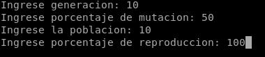

# Triangulacion de Imagenes

Como proyecto de admision del periodo Enero-Marzo 2018 del GIA, se insto a diseñar un algoritmo genetico el cual
pudiera aproximar mediante triangulos cualquier imagen dada. El proyecto presentado plantea una solucion sencilla
la cual converge rapidamente. Sin embargo, **no** debe tomarse como una version definitiva, pues aun tiene 
una gran refactorizacion pendiente.

## Instalacion

Basta con Clonar el repositorio e instalar las dependencias señaladas en el archivo: requirements.txt mediante:

```
$ pip3 install -r requirements.txt 
```

Y listo para correr!

## Ejecutando el script

Basta con llamar al script mediante la consola con python:

```
python3 SERIO.py
```
E introduzca los datos pedidos, una corrida comun se veria como:



## Authors

* **Daniel Pinto** [github](https://github.com/PurpleBooth)

